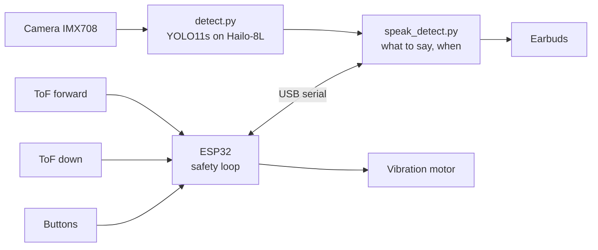
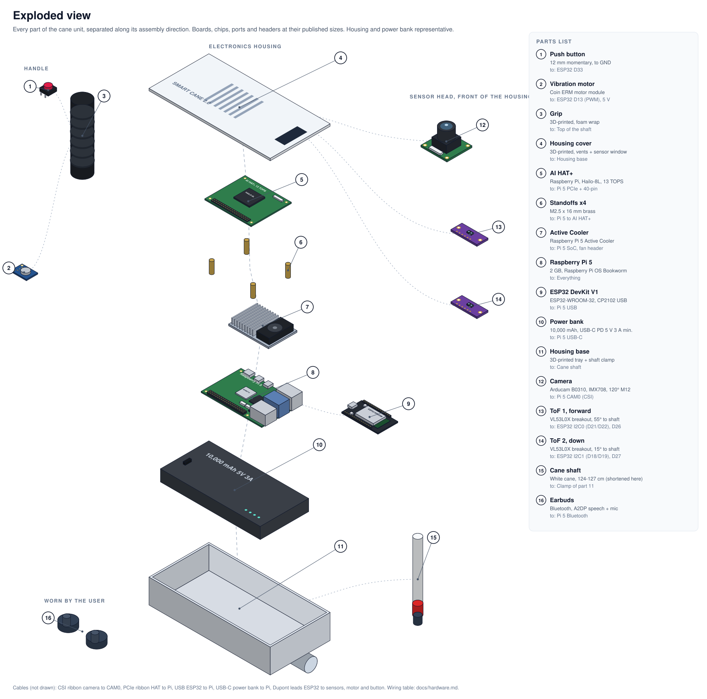

# Smart Cane 2.0

**An offline AI white cane for blind and low-vision pedestrians.** A camera and an on-cane AI accelerator name 152 kinds of object with their direction and distance, two time-of-flight sensors catch obstacles and drop-offs, and a vibration motor alerts within a second of power-on, with or without the computer running.

Built for the KSCDR Hackathon. Working prototype, tested indoors. Everything runs on the cane: no phone, no internet and no subscription needed (the optional AI assistant uses the internet).


<p align="center"></p>

## Contents

- [What it does](#what-it-does)
- [How it works](#how-it-works)
- [Hardware](#hardware)
- [Objects it recognises](#objects-it-recognises)
- [Measured results](#measured-results)
- [Build your own](#build-your-own)
- [Train the model](#train-the-model)
- [Repository layout](#repository-layout)
- [Testing](#testing)
- [Troubleshooting](#troubleshooting)
- [Limitations](#limitations)
- [Roadmap](#roadmap)
- [License and data](#license-and-data)
- [Acknowledgements](#acknowledgements)

## What it does

| Feature | How | Status |
|---|---|---|
| Names objects with direction and distance | Camera + YOLO11s on a Hailo-8L. "chair ahead, 1.3 meters", "car left, about 4 meters" | Working |
| Obstacle alert by vibration | Forward ToF sensor on an ESP32, parking-sensor style pulses that speed up as you get closer, silent beyond 1.5 m | Working |
| Drop-off, pothole and kerb alert | Down ToF sensor learns the ground and alarms on a sudden change: one long pulse plus "Careful, drop ahead" | Working on the bench, tuning on a walk is open |
| Works before the computer has booted | The ESP32 safety loop runs on its own, about 1 s after power-on | Working |
| Anything unknown is still announced | Low-confidence or untrained objects become "obstacle" with direction and distance | Working |
| Describe the scene, read text, answer a question | Button on the handle. Gemini online, Tesseract OCR offline for reading | Working |
| Tells you when it is broken | Spoken warnings for a dead camera, dead sensors, a lost serial link or a ground sensor that cannot see the ground | Working |

## How it works



1. **Reflexes on the ESP32.** Both distance sensors, the motor and the buttons hang off an ESP32. It vibrates for obstacles and drop-offs on its own, so a slow boot or a crash on the Pi never silences the safety alerts.
2. **Vision on the Pi 5.** Each camera frame is turned upright, kept in R,G,B order and letterboxed into the model's 640x640 input, then the Hailo-8L runs the 152-class detector in about 29 ms. Every object gets a bearing in degrees and a distance estimate from its size.
3. **Speech that respects attention.** A class must appear in 3 reports in a row before it is spoken. Each object has its own repeat timer. Speech never queues. The forward ToF supplies the real distance for whatever is straight ahead.

Details: [docs/software.md](docs/software.md).

## Hardware

<p align="center"></p>

| Part | Model |
|---|---|
| Computer | Raspberry Pi 5, 2 GB, with Active Cooler |
| AI accelerator | Raspberry Pi AI HAT+, Hailo-8L (13 TOPS) |
| Camera | Arducam B0310, Sony IMX708, 120° M12 lens |
| Safety controller | ESP32 DevKit V1 |
| Distance | 2x VL53L0X time-of-flight (forward at 115 cm, down at 110 cm up the shaft) |
| Feedback | Coin vibration motor module, Bluetooth earbuds |
| Controls | 2 push buttons (assistant, read text) |
| Power | 10,000 mAh USB-C power bank (must hold 5 V at 3 A or more, see [power.md](docs/power.md)) |

Wiring, mounting angles, assembly order and the cross-section: [docs/hardware.md](docs/hardware.md).

## Objects it recognises

152 classes, chosen for sidewalks, crossings and indoors:

| Group | Examples |
|---|---|
| Ground hazards | open hole, pothole, manhole, storm drain, stairs, escalator, curb, curb ramp, speed bump, rail track, tactile paving |
| Vehicles | car, bus, truck, van, taxi, ambulance, motorcycle, bicycle, e-scooter, train, shopping cart |
| People and animals | person, child, cyclist, wheelchair, stroller, dog, cat, cow, horse, goat, camel |
| Crossings and signs | crosswalk, traffic light, pedestrian signal, crosswalk button, stop sign, bus stop sign, wet floor sign |
| Street obstacles | pole, bollard, traffic cone, barrier, fence, bench, trash can, fire hydrant, pillar |
| Indoors | door, elevator, chair, table, desk, couch, bed, toilet, sink, refrigerator, stairs |
| Things to find | backpack, suitcase, umbrella, bottle, cup, cell phone, glasses, book |

The complete list, with the number of training examples, validation accuracy and urgency for every class: **[docs/objects.md](docs/objects.md)**.

## Measured results

| | Result |
|---|---|
| Model accuracy (27,906 validation images) | mAP50 0.535, mAP50-95 0.376 |
| Objects named / noticed on 408 street photos, camera path | 55 % / 66 % (was 40 % / 53 % before the 8 Oct fixes) |
| Hailo inference per frame | 29 ms |
| ESP32 power-on to first sensor reading | 0.81 s |
| Pi boot to ready | 5.9 to 9.4 s |
| ToF repeatability on the bench | stdev 1.0 to 1.2 mm |

Every number, with date and method: [docs/results.md](docs/results.md).

## Build your own

### 1. Assemble

Follow [docs/hardware.md](docs/hardware.md): Pi 5 stack (cooler, spacers, header, PCIe ribbon, AI HAT+), camera on CAM0, ESP32 wired with crimped Dupont leads, sensors on the shaft at the listed angles, motor against the grip wall.

### 2. Set up the Raspberry Pi

Raspberry Pi OS Bookworm 64-bit (Lite is enough). Then:

```bash
git clone https://github.com/adeliusa486/KSCDR-Hackathon-SmartCane2.0.git
mkdir -p ~/smartcane/models
cp -r KSCDR-Hackathon-SmartCane2.0/code/* ~/smartcane/
cp KSCDR-Hackathon-SmartCane2.0/models/smartcane152_v3/smartcane152_v3_h8l.hef \
   KSCDR-Hackathon-SmartCane2.0/models/smartcane152_v3/smartcane152.txt ~/smartcane/models/
cd ~/smartcane && chmod +x setup_pi.sh && ./setup_pi.sh    # Hailo stack, camera stack, PCIe Gen3
sudo reboot
```

The cane's model was compiled with Hailo DFC 3.34 and runs on **HailoRT 4.23**. Raspberry Pi's apt repository stops at 4.20, so build 4.23 from Hailo's open-source repositories and install it (the installer tests itself and rolls back on failure):

```bash
nohup bash ~/smartcane/tools/hailort_build.sh > ~/hailort423/build.log 2>&1 &
bash ~/smartcane/tools/hailort_install.sh 2>&1 | tee ~/hailort423/install.log
```

Check the hardware:

```bash
hailortcli fw-control identify      # Device Architecture: HAILO8L, firmware 4.23.0
rpicam-hello --list-cameras         # imx708
python3 ~/smartcane/check_hardware.py
```

Speech, Bluetooth audio, serial and offline reading need:

```bash
sudo apt install -y espeak-ng pulseaudio pulseaudio-module-bluetooth python3-serial tesseract-ocr
```

Pair the earbuds once with `bluetoothctl` (pair, trust, connect) and set your earbuds' address with `--bt-mac` in the service file.

### 3. Flash the ESP32 (from the Pi, over the same USB cable)

```bash
curl -fsSL https://raw.githubusercontent.com/arduino/arduino-cli/master/install.sh | BINDIR=~/.local/bin sh
~/.local/bin/arduino-cli config init
~/.local/bin/arduino-cli config add board_manager.additional_urls \
    https://espressif.github.io/arduino-esp32/package_esp32_index.json
~/.local/bin/arduino-cli core update-index
~/.local/bin/arduino-cli core install esp32:esp32        # tested with 3.3.12
~/.local/bin/arduino-cli lib install VL53L0X             # Pololu, tested with 1.3.1
~/.local/bin/arduino-cli compile --fqbn esp32:esp32:esp32 --output-dir ~/smartcane/esp32/build \
    ~/smartcane/esp32/cane_safety
~/.local/bin/arduino-cli upload --fqbn esp32:esp32:esp32 -p /dev/ttyUSB0 \
    --input-dir ~/smartcane/esp32/build ~/smartcane/esp32/cane_safety
python3 ~/smartcane/esp32_link.py --send T --send S --seconds 3   # both IDs EE AA 10, fw=2026-10-08
```

For later updates use the verified flash scripts in `code/tools/flash_*.sh`, which compare the running firmware with the last good build first and roll back on any failure.

### 4. Start on boot

```bash
sudo loginctl enable-linger pi
mkdir -p ~/.config/systemd/user && cp ~/smartcane/smartcane.service ~/.config/systemd/user/
systemctl --user daemon-reload && systemctl --user enable --now smartcane
```

Power on, wait about 20 seconds, and the cane says "Smart cane ready". The ESP32 buzzes twice within a second of power-on.

### 5. Check the camera orientation

Hold the cane as when walking and run (the service must be stopped while you do):

```bash
systemctl --user stop smartcane
python3 ~/smartcane/tools/vision_probe.py --model ~/smartcane/models/smartcane152_v3_h8l.hef \
    --labels ~/smartcane/models/smartcane152.txt --orient
systemctl --user start smartcane
```

If it suggests a rotation other than 0, set `--rotate` in the service file.

## Train the model

The training set (263,857 images from COCO, Open Images V7, Mapillary Vistas, the Mapillary Traffic Sign Dataset and 20 Roboflow projects), the pseudo-labelling and cleaning steps, the training runs and the Hailo compile are documented in **[docs/training.md](docs/training.md)**. All label files, the class mapping and every pipeline script are in this repository. The images are fetched from the original sources.

## Repository layout

```text
code/
  detect.py              camera -> Hailo -> objects with direction and distance
  speak_detect.py        what to say and when, ESP32 link, assistant, service entry point
  esp32_link.py          serial link to the ESP32 (auto-reopen)
  assistant.py           describe / read / ask, Gemini online, Tesseract offline
  esp32/cane_safety/     ESP32 firmware: sensors, ground watch, vibration, buttons
  smartcane.service      systemd user service
  tests/                 simulation tests, no hardware needed
  tools/                 probes, evaluation, flashing, power soak, backups
  training/              dataset build, pseudo-labelling, training, validation, label export
models/smartcane152_v3/  HEF for the Hailo-8L, PyTorch weights, ONNX, class names
data/merged_v2/          every training label, counts per class and per source
docs/                    hardware, software, training, objects, results, power, plan, figures
experiments/             test plans and raw results per development step
baseline/                frozen state of the cane before the consumer-readiness work
MEMORY.md                the full engineering log, every session since 19 Sep 2026
```

## Testing

```bash
cd ~/smartcane && python3 -m unittest tests/test_cane.py    # on the Pi: 46 tests
python -m pytest code/tests/test_cane.py -q                  # on a PC: 40 pass, 6 need a Linux pty
python3 code/tools/hazard_eval.py --help                     # accuracy on labelled photos, on the Pi
```

## Troubleshooting

**It said "person right" when I stood in front of it.** Directions are the cane's, not yours. Facing the cane, your left is its right. "Ahead" covers ±15° and anything crossing the centre line. Before 8 October the code assumed a 120° view while the sensor mode gives 98°, which made "ahead" only ±6.7° wide.

**It only says "person".** Check the picture is upright (step 5) and the room is lit: below about 20 lux the camera's exposure runs to 66 ms and any movement blurs the frame. Some furniture is weak in the model itself (desk, cabinet, see objects.md).

**"Warning, distance sensors not responding".** The ESP32 link is silent. The cane reopens the port every few seconds on its own. If it persists, check the USB cable and run `python3 esp32_link.py --send S`.

**The vibration is weak.** Mount the motor against the grip wall where your hand presses, and test `python3 esp32_link.py --send B100,1000`. See item B2 in the [implementation plan](docs/implementation-plan.md).

**The Pi turns on, the LED goes red and it switches off.** The power supply cannot hold 5 V. See [docs/power.md](docs/power.md).

**No speech.** Run `pactl info | grep "Default Sink"`. `auto_null` means the earbuds are disconnected: `bluetoothctl connect <address>`.

Live log: `sudo journalctl _SYSTEMD_USER_UNIT=smartcane.service -f`.

## Limitations

- Indoor-tested prototype, not yet tested by blind users or on a long street walk. Not a medical device and not a replacement for orientation and mobility training.
- Weak classes (curb, crosswalk, manhole, pole, desk, cabinet) are often heard as "obstacle".
- The VL53L0X reaches about 2 m indoors and much less in sunlight, and cannot see glass reliably.
- Without an IMU, swinging the cane changes the ground distance, so the drop-off thresholds still need tuning on real walks.
- Bluetooth audio drops out. A wired headset is planned.
- The power path needs a supply that holds 5 V under load.

## Roadmap

The full plan, with a pass test for each item, is in **[docs/implementation-plan.md](docs/implementation-plan.md)**: power that holds 5 V, a motor you feel while walking, ToF calibration, drop-off tuning from recorded walks plus an IMU, wired audio, a recompile with letterboxed calibration, more data for weak classes, and testing with blind users.

## License and data

Code, firmware, documentation and figures: [MIT](LICENSE). Training labels in `data/` keep the licences of their source datasets, two of which are non-commercial: see [data/LICENSE.md](data/LICENSE.md).

## Acknowledgements

COCO, Open Images V7, Mapillary Vistas, the Mapillary Traffic Sign Dataset and the Roboflow Universe authors for the training data. Ultralytics for YOLO11. Hailo for the open-source HailoRT and the Dataflow Compiler. Raspberry Pi for Picamera2. Pololu for the VL53L0X library.
