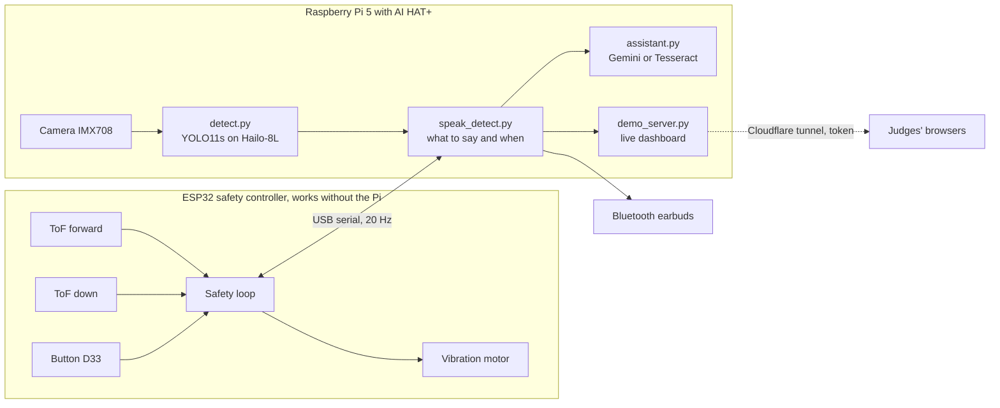
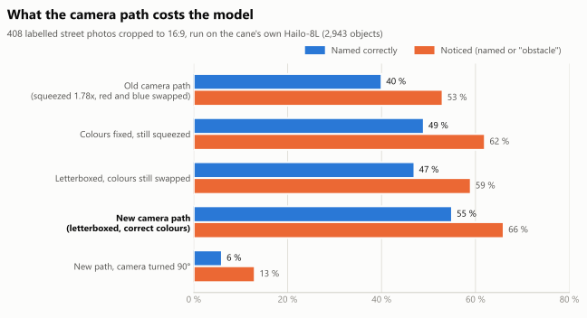
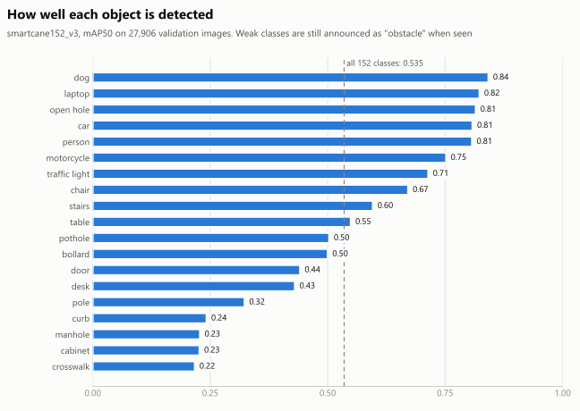

# Smart Cane 2.0

**An offline AI white cane for blind and low-vision pedestrians.** A camera and an AI accelerator on the cane name 152 kinds of object with their direction and distance. Two time-of-flight sensors catch obstacles and drop-offs, and a vibration motor alerts within a second of power-on, whether the computer has booted or not.

Working prototype built for the KSCDR Hackathon, tested indoors and on the bench. Walking needs no phone, no internet and no subscription. Only the optional AI assistant uses the internet, and it falls back to on-cane text reading without it.

[](https://adeliusa486.github.io/KSCDR-Hackathon-SmartCane2.0/live.html)
[](https://adeliusa486.github.io/KSCDR-Hackathon-SmartCane2.0/)

[](https://github.com/adeliusa486/KSCDR-Hackathon-SmartCane2.0/actions/workflows/ci.yml)
[](https://github.com/adeliusa486/KSCDR-Hackathon-SmartCane2.0/actions/workflows/pages.yml)


<p align="center"><a href="https://adeliusa486.github.io/KSCDR-Hackathon-SmartCane2.0/live.html"></a></p>
<p align="center"><sub>The live dashboard playing a real 30-second recording from the cane (8 October 2026). Two chairs, one at about 4.3 m, and a wall unit the model labels "tv". Click to open it.</sub></p>

## Contents

- [What it does](#what-it-does)
- [Live dashboard](#live-dashboard)
- [System architecture](#system-architecture)
- [The one-button assistant](#the-one-button-assistant)
- [Hardware](#hardware)
- [Objects it recognises](#objects-it-recognises)
- [Measured results](#measured-results)
- [Model and training data](#model-and-training-data)
- [Operating the prototype](#operating-the-prototype)
- [Repository layout](#repository-layout)
- [Quality: tests and CI/CD](#quality-tests-and-cicd)
- [Troubleshooting](#troubleshooting)
- [Limitations](#limitations)
- [Roadmap](#roadmap)
- [License and data](#license-and-data)
- [Acknowledgements](#acknowledgements)

## What it does

| Feature | How | Status |
|---|---|---|
| Names objects with direction and distance | Camera and YOLO11s on a Hailo-8L: "chair ahead, 1.3 meters", "car left, about 4 meters" | Working |
| Obstacle alert by vibration | Forward ToF sensor on the ESP32. Pulses speed up as you get closer, silent beyond 1.5 m, solid under 0.4 m | Working |
| Drop-off, pothole and kerb alert | Down ToF sensor learns the ground and alarms on a sudden change: one long pulse and "Careful, drop ahead" | Working on the bench, tuning on walks open |
| Works before the computer has booted | The ESP32 safety loop runs on its own, first reading 0.81 s after power-on | Working |
| Anything unknown is still announced | Low-confidence or untrained objects become "obstacle" with direction and distance | Working |
| Describe the scene, answer a question, read text | One button. Gemini online, the cane's own detector and Tesseract OCR offline | Working |
| Says when it is broken | Spoken warnings for a dead camera, a lost sensor link or a ground sensor that cannot see the ground | Working |
| Live dashboard for judges | Camera with real boxes, real ToF and camera distances, speech log, in any browser through a secure tunnel | Working |

## Live dashboard

Open **[the live dashboard](https://adeliusa486.github.io/KSCDR-Hackathon-SmartCane2.0/live.html)** in any browser:

- **During a demo** the page connects to the cane itself. You see the camera with the cane's own boxes, each object's bearing and distance, the forward ToF reading next to the camera's estimate for the object straight ahead, the ground sensor and everything the cane says, updated four times a second.
- **At any other time** it plays a real 30-second recording from the cane, labelled with its date. Add `?at=15` to the address to start 15 s in.

How the team takes the cane live:

```bash
# on the cane, in a terminal kept open for the demo
bash ~/smartcane/tools/go_live.sh
```

The script checks that the dashboard is running and locked, opens a Cloudflare tunnel, waits until the new public address answers, and prints two links: one straight to the cane and one through the website. Ctrl-C closes the tunnel and the cane is private again.

| Safeguard | Detail |
|---|---|
| Access token | Every address except `/health` needs the cane's private token. Tested through the public tunnel on 8 October 2026: no token or a wrong token returns 403 |
| No open ports | The tunnel is an outgoing connection from the cane. No router setup, and it works on a phone hotspot |
| No cost when idle | The camera view is drawn only while someone watches: detect.py uses about 10 % of a CPU core unwatched and 30 % watched |
| Works through proxies | The page polls single requests instead of holding a stream open, because the tunnel held streams back (0 bytes in 6 s in testing) |

Setup, a fixed address, bandwidth and privacy notes: [docs/deployment.md](docs/deployment.md).

## System architecture



1. **Reflexes on the ESP32.** Both distance sensors, the motor and the button hang off an ESP32. It vibrates for obstacles and drop-offs on its own, so a slow boot or a crash on the Pi never silences the safety alerts.
2. **Vision on the Pi 5.** Each frame is turned upright, kept in R,G,B order and letterboxed into the model's 640x640 input. The Hailo-8L runs the 152-class detector in about 29 ms. Every object gets a bearing in degrees and a distance estimate from its size.
3. **Speech that respects attention.** A class must appear in 3 reports in a row before it is spoken. Each object has its own repeat timer, speech never queues, and drop-offs come first. The forward ToF supplies the measured distance for whatever is straight ahead.

Details: [docs/software.md](docs/software.md).

## The one-button assistant

One push button on the handle (ESP32 pin D33) runs the assistant. The cane checks the internet on every press and picks the mode by itself.

| Press | Online (Gemini) | Offline |
|---|---|---|
| **Short** | "Looking", then a description of the scene. One buzz, then it listens 5 s on the earbud microphone. Ask anything, for example "read the sign", and it answers from a fresh photo | Says at once what the cane's own detector sees, then reads any text with Tesseract |
| **Hold 1 s** (a short buzz says you can let go) | "Reading", then the text word for word | Tesseract reads the text on the cane |

## Hardware

<p align="center"></p>

| Part | Model |
|---|---|
| Computer | Raspberry Pi 5, 2 GB, with Active Cooler and 32 GB A2 microSD |
| AI accelerator | Raspberry Pi AI HAT+, Hailo-8L, 13 TOPS |
| Camera | Arducam B0310, Sony IMX708, 120° M12 lens |
| Safety controller | ESP32 DevKit V1 |
| Distance sensors | 2x ST VL53L0X time-of-flight: forward at 115 cm up the shaft, down at 110 cm |
| Feedback | Coin vibration motor module against the grip, Bluetooth earbuds |
| Control | 1 push button on the handle |
| Power | 10,000 mAh USB-C power bank. It must hold 5 V at 3 A or more ([docs/power.md](docs/power.md)) |
| Body | White cane, 124 to 127 cm |

<p align="center"></p>

Wiring, mounting angles and bring-up checks: [docs/hardware.md](docs/hardware.md). Power behaviour and the brown-out fix: [docs/power.md](docs/power.md).

## Objects it recognises

The detector names 152 kinds of object, chosen for sidewalks, crossings and indoors. Anything it is unsure of is announced as "obstacle" with its direction and distance.

<!-- OBJECTS:START -->

| Group | Objects |
|---|---|
| People and mobility (6) | **person**, child, cyclist, motorcyclist, **wheelchair**, **stroller** |
| Animals (8) | **dog**, **cat**, bird, **horse**, **cow**, **sheep**, goat, camel |
| Vehicles (14) | **car**, **bus**, truck, van, taxi, ambulance, **motorcycle**, bicycle, **e-scooter**, **skateboard**, **train**, golf cart, shopping cart, trailer |
| Ground hazards and level changes (14) | **open hole**, pothole, manhole, storm drain, stairs, escalator, curb, curb ramp, ramp, **speed bump**, sidewalk crack, rail track, tactile paving, **swimming pool** |
| Crossings, signals and signs (16) | crosswalk, **traffic light**, pedestrian signal, **crosswalk button**, stop sign, traffic sign, yield sign, do not enter sign, one way sign, pedestrian crossing sign, speed limit sign, construction sign, **sidewalk closed sign**, bus stop sign, exit sign, **wet floor sign** |
| Street furniture and obstacles (24) | pole, utility pole, street light, bollard, traffic cone, barrier, fence, barrel, fire hydrant, parking meter, bench, trash can, bike rack, mailbox, utility box, billboard, sidewalk sign, kiosk, fountain, sculpture, pillar, **ladder**, tent, potted plant |
| Buildings and entrances (6) | door, door handle, window, building, **elevator**, atm |
| Trees and plants (3) | tree, palm tree, plant |
| Furniture (20) | chair, stool, couch, **bed**, table, desk, coffee table, nightstand, chest of drawers, wardrobe, cabinet, shelf, bookcase, countertop, mirror, curtain, lamp, **ceiling fan**, pillow, **clock** |
| Bathroom and kitchen (12) | **toilet**, sink, **bathtub**, shower, refrigerator, **microwave**, oven, stove, **washing machine**, kettle, towel, toothbrush |
| Electronics (6) | **tv**, **laptop**, **keyboard**, **mouse**, remote, cell phone |
| Things you carry or find (23) | backpack, handbag, suitcase, umbrella, glasses, book, bottle, cup, can, box, plastic bag, tire, ball, toy, scissors, knife, fork, spoon, **bowl**, plate, banana, apple, orange |

**Bold**: reliable, mAP50 of 0.70 or more on the validation set. Accuracy, training examples and speech urgency for every object: [docs/objects.md](docs/objects.md).

<!-- OBJECTS:END -->

## Measured results

| Measurement | Result |
|---|---|
| Model accuracy, 27,906 validation images | mAP50 0.535, mAP50-95 0.376 |
| 408 street photos through the cane's camera path | 55 % named, 66 % noticed (40 % and 53 % before the 8 October fixes) |
| Hailo-8L inference per frame | 29 ms. Benchmark 38.7 FPS, the cane runs at 10 fps |
| ESP32 power-on to first sensor reading | 0.81 s |
| Pi boot to `systemd` ready | 5.9 to 9.4 s |
| ToF repeatability on the bench | stdev 1.04 mm and 1.17 mm |
| Live dashboard cost (detect.py) | 10 % of a CPU core unwatched, 30 % watched |

<table>
<tr>
<td width="50%"><picture><source media="(prefers-color-scheme: dark)" srcset="docs/charts/camera-path-dark.svg"></picture></td>
<td width="50%"><picture><source media="(prefers-color-scheme: dark)" srcset="docs/charts/training-dark.svg"></picture></td>
</tr>
<tr>
<td width="50%"><picture><source media="(prefers-color-scheme: dark)" srcset="docs/charts/safety-classes-dark.svg"></picture></td>
<td width="50%"><picture><source media="(prefers-color-scheme: dark)" srcset="docs/charts/dataset-dark.svg"></picture></td>
</tr>
</table>

Every number with its date and method: [docs/results.md](docs/results.md). The charts are generated by `docs/charts/make_charts.py`.

## Model and training data

**smartcane152_v3** is YOLO11s trained on 263,857 images from COCO 2017, Open Images V7, Mapillary Vistas v2, the Mapillary Traffic Sign Dataset and 20 Roboflow Universe projects. Two teacher models added 517,087 pseudo-labels for classes each source never labelled, and two systematic errors were cleaned out before training. The best of 27 epochs (epoch 24) reached mAP50 0.536 on validation. It was compiled with the Hailo Dataflow Compiler 3.34 and runs on HailoRT 4.23.

| File | Use |
|---|---|
| `models/smartcane152_v3/smartcane152_v3_h8l.hef` | The model running on the cane (Hailo-8L), byte-identical to the deployed file |
| `models/smartcane152_v3/smartcane152_v3_best.pt` | PyTorch weights |
| `models/smartcane152_v3/smartcane152_v3.onnx` | ONNX export used for the Hailo compile |
| `data/merged_v2/` | Every final label, the human labels before pseudo-labelling, all added and removed boxes, counts per class and per source |

Dataset, training runs and compile settings: [docs/training.md](docs/training.md).

## Operating the prototype

1. **Power on.** The ESP32 safety loop starts within a second, before the Pi has booted.
2. **Wait for "Smart cane ready"**, about 20 s after power-on. Speech goes to the paired earbuds.
3. **Walk.** Objects are spoken by urgency, obstacles straight ahead vibrate, drop-offs give one long pulse and a spoken warning.
4. **Press or hold the button** for the assistant (see above).
5. **For a demo**, run `bash ~/smartcane/tools/go_live.sh` and share the printed link.

Live log on the cane: `sudo journalctl _SYSTEMD_USER_UNIT=smartcane.service -f`. Program details, service settings and maintenance tools: [docs/software.md](docs/software.md).

## Repository layout

```text
code/
  detect.py              camera -> Hailo-8L -> objects with direction and distance
  speak_detect.py        what to say and when, ESP32 link, assistant, service entry point
  assistant.py           one-button assistant: Gemini online, detector and Tesseract offline
  esp32_link.py          serial link to the ESP32, reopens itself after a stall
  demo_server.py         live dashboard server (token, state, frames)
  demo_view.py           draws the cane's boxes on the camera frame, only while watched
  demo_dashboard.html    the dashboard page, also the website's live.html
  esp32/cane_safety/     ESP32 firmware: sensors, ground watch, vibration, button
  smartcane.service      systemd user service that starts the cane at boot
  tests/                 62 simulation tests, no hardware needed
  tools/                 go_live.sh, record_demo.py, probes, evaluation, verified flashing, backups
  training/              dataset build, pseudo-labelling, training, validation, label export
models/smartcane152_v3/  HEF for the Hailo-8L, PyTorch weights, ONNX, class names
data/merged_v2/          training labels, counts per class and per source
docs/                    hardware, software, deployment, training, objects, results, power, plan
web/                     project website source and the dashboard recording (web/replay/)
.github/workflows/       CI (tests, firmware build, website build) and the website deployment
experiments/             test plans and raw results per development step
MEMORY.md                engineering log, every session since 19 September 2026
```

## Quality: tests and CI/CD

```bash
cd ~/smartcane && python3 -m unittest tests/test_cane.py    # on the cane: 62 tests
python -m pytest code/tests/test_cane.py -q                  # on a PC: 56 pass, 6 need a Linux pty
```

The tests simulate blind-user scenarios without a camera, Hailo, ESP32 or audio: naming of every safety class, urgency order, the obstacle fallback, distances in metres, the ToF consistency check, picture geometry, the real serial link on a pseudo-terminal, every assistant path and failure, and the dashboard server, including its token and the watch-only drawing.

| Workflow | Runs on | What it does |
|---|---|---|
| [`ci.yml`](.github/workflows/ci.yml) | Every push and pull request | flake8 for syntax errors and undefined names, all 62 tests, the training-pipeline tests, an ESP32 firmware compile with the exact core and library versions on the cane, and a website build |
| [`pages.yml`](.github/workflows/pages.yml) | Every push to `main` that touches the website, docs or dashboard | Builds the website with `web/build.py` and deploys it to GitHub Pages |

## Troubleshooting

| Symptom | Cause and fix |
|---|---|
| It says "person right" when you stand in front of it | Directions are the cane's, not yours. Facing the cane, your left is its right. "Ahead" covers ±15° and anything crossing the centre line |
| It mostly says "person" or "obstacle" | Check the picture is upright with `tools/vision_probe.py --orient` while holding the cane as when walking, and that the room is lit. Below about 20 lux the exposure reaches 66 ms and movement blurs the frame |
| "Warning, distance sensors not responding" | The ESP32 link is silent. The cane reopens the port every few seconds. If it persists, check the USB cable and run `python3 esp32_link.py --send S` |
| The vibration is weak | Mount the motor against the grip wall where the hand presses. Test with `python3 esp32_link.py --send B100,1000` |
| The Pi LED turns red and it switches off | The power bank cannot hold 5 V under load. See [docs/power.md](docs/power.md) |
| No speech | `pactl info \| grep "Default Sink"` shows `auto_null`: the earbuds are disconnected. Run `bluetoothctl connect <address>` |
| The dashboard link says "token required" | The link lost its `?token=` part. Copy the whole link printed by `go_live.sh` |
| The website cannot reach the cane | The tunnel is closed or its address changed. Run `go_live.sh` again and use the new link |

## Limitations

- Indoor-tested prototype, not yet tested by blind users or on a long street walk. Not a medical device, and not a replacement for the white cane technique or orientation and mobility training.
- Weak classes (curb, crosswalk, manhole, pole, desk, cabinet) are often heard as "obstacle". The model also makes false detections, for example a plain wall labelled "bathtub" in the dashboard recording.
- The VL53L0X reaches about 2 m indoors, much less in sunlight, and does not see glass reliably.
- Without an IMU, swinging the cane changes the ground distance, so the drop-off thresholds still need tuning on real walks.
- Bluetooth audio drops out at times. A wired headset is planned.
- A quick tunnel gets a new address on every start, and the picture is slower through it than on the local network.

## Roadmap

The full plan, with a pass test for each item, is in [docs/implementation-plan.md](docs/implementation-plan.md): a power path that holds 5 V, a motor you feel while walking, ToF calibration, drop-off tuning from recorded walks plus an IMU, wired audio, a recompile with letterboxed calibration images, more data for weak classes, and testing with blind users.

## License and data

Code, firmware, documentation and figures: [MIT](LICENSE). Training labels in `data/` keep the licences of their source datasets, two of which are non-commercial: see [data/LICENSE.md](data/LICENSE.md).

## Acknowledgements

COCO, Open Images V7, Mapillary Vistas, the Mapillary Traffic Sign Dataset and the Roboflow Universe authors for the training data. Ultralytics for YOLO11. Hailo for HailoRT and the Dataflow Compiler. Raspberry Pi for Picamera2. Pololu for the VL53L0X library. Cloudflare for the tunnel used in live demos.
