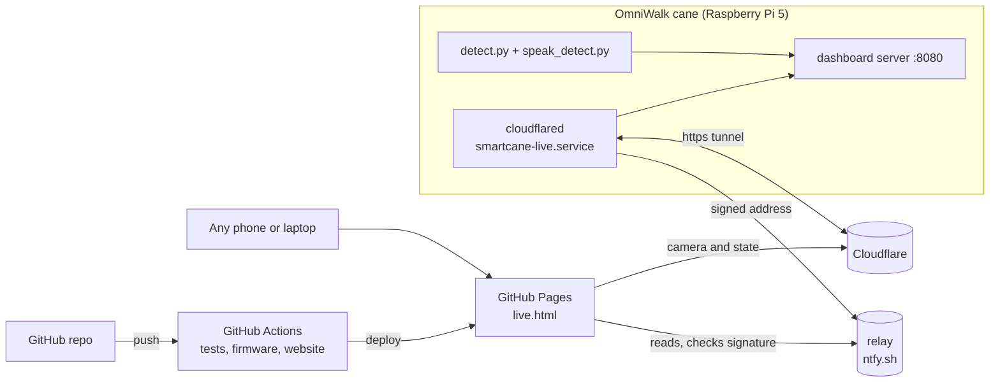

# Live dashboard, cloud access and CI/CD

How anyone watches the cane detect objects live from anywhere, and how the repository tests, builds and publishes itself.



| Piece | Where it runs | What it gives |
|---|---|---|
| Dashboard server | On the cane, always on (`speak_detect.py --demo-port 8080 --demo-public`) | Camera with boxes, objects with bearing and distance, ToF vs camera distance, ground sensor, speech log |
| Tunnel | On the cane, started at every boot (`smartcane-live.service`) | A public https address, no router setup, works on a phone hotspot |
| Relay | ntfy.sh, a free public message service | Tells the website the cane's current address. Each post is signed by the cane |
| Website | GitHub Pages, deployed by GitHub Actions | Project page plus `live.html`, which finds the cane and shows it live, or street-photo examples while it is off |

## 1. Switch on, watch anywhere

1. The cane boots and joins a known Wi-Fi: the home network first, the owner's phone hotspot when home is out of range (NetworkManager priorities 10 and -5).
2. `smartcane-live.service` runs `code/tools/live_tunnel.sh`: it opens a Cloudflare quick tunnel to the dashboard, waits until the address answers from outside, and posts `<address> <unix time> <signature>` to the relay topic `omniwalk-c3b2b75649938dd6`. It posts again every 30 minutes (the relay keeps messages 12 hours). If the tunnel drops, systemd restarts the script after 15 s, which gives a new address and a new post.
3. [`live.html`](https://adeliusa486.github.io/OmniWalk/live.html) reads the topic, takes the newest post whose Ed25519 signature checks against the cane's public key, checks that the address answers, and connects. While nothing answers it shows the street-photo examples and looks again every 10 s, so it switches to live by itself when the cane comes on. If the cane restarts during viewing, the page follows it to its new address.

Measured on 8 October 2026: after a reboot command the signed address was on the relay 80 s later (26 s to boot). A browser with no stored settings went live 3.2 s after opening the page. The newest message on the topic was a forged address, and the page ignored it.

**On the same Wi-Fi** the cane's own page is fastest: `http://smartcane.local:8080` (or the cane's IP address). The website cannot use that address, because browsers block an https page from loading an http address on the local network.

| Path | Pictures per second, measured 8 Oct 2026 |
|---|---|
| Same Wi-Fi, the cane's own page | 9.8 (every camera frame) |
| Internet, through the tunnel, 6 request lanes | 7.0 (4.0 with 4 lanes, 7.4 with 8) |

**The signing key.** `live_tunnel.sh` creates `~/.config/smartcane/live_key.pem` (Ed25519, readable only by `pi`) on its first run and prints the public key. The public key and the topic name are in `code/demo_dashboard.html` (`PUBKEY`, `RELAY`). The topic is the first 16 hex digits of the SHA-256 of the raw public key. A new key means updating both and pushing the website. Anyone can write to the topic, but only the cane can sign, and the page connects only to `https://….trycloudflare.com` addresses with a valid signature from the last 13 hours.

```bash
systemctl --user status smartcane-live          # online?
tail ~/.cache/smartcane/live_tunnel.log         # cloudflared's log, with the address
bash ~/smartcane/tools/go_live.sh               # prints the current links
systemctl --user disable --now smartcane-live   # keep the cane off the internet
```

## 2. Who can watch

The service runs the dashboard with `--demo-public`: anyone who opens the live page sees the camera while the cane is on (the owner's choice, 8 October 2026). Without that flag every address except `/health` needs the token in `~/.config/smartcane/demo_token`, and the page shows a token field when the cane refuses it.

- **Privacy:** the camera shows whatever is in front of the cane, including the room it is in. Switch the cane off, or stop `smartcane-live`, when that should not be public.
- **Cost:** the camera view is drawn only while someone has a dashboard open. Unwatched, the cane runs as if the dashboard were off.
- **Bandwidth:** about 30 KB per live picture (measured 29 to 33 KB on 8 October 2026). A viewer at 7 pictures a second takes about 1.7 Mbit/s of the cane's upload. On a phone hotspot, plan for a few viewers, or share one screen.
- **Power:** dashboard plus tunnel add load. Use a supply that holds 5 V (see [power.md](power.md)).

**Why the page polls instead of streaming.** Through a quick tunnel, a long-lived stream is held back: the server-sent event stream delivered 0 bytes in 6 s, and the MJPEG stream arrived in 256 KB blocks. Single requests pass at once. So the page fetches `/state.json` four times a second and `/frame.jpg?after=<id>` on staggered lanes. The cane answers a picture request as soon as a frame newer than `<id>` is drawn (or with 204 after 2 s), so no picture is sent twice. The streaming endpoints remain for local use, for example `/stream.mjpg` in VLC.

**A fixed address** (for example `cane.yourdomain.com`) needs a free Cloudflare account and a domain on Cloudflare: `cloudflared tunnel login`, `tunnel create`, `tunnel route dns`, and a `config.yml` pointing at `http://localhost:8080`. With a fixed address the relay is no longer needed.

## 3. The website on GitHub Pages (CI/CD)

**One-time setup** on GitHub: repository **Settings > Pages > Build and deployment > Source: GitHub Actions**.

After that, every push to `main` that changes the website, the docs or the dashboard runs `.github/workflows/pages.yml`:

1. checks out the repository,
2. runs `python web/build.py` (project page, `live.html` from `code/demo_dashboard.html`, figures, charts, the objects list generated from the model's data, and `web/replay/`),
3. deploys `web/_site` to `https://adeliusa486.github.io/OmniWalk/`.

**Continuous integration**, `.github/workflows/ci.yml`, runs on every push and pull request:

| Job | What it checks |
|---|---|
| Cane software tests | `flake8` for syntax errors and undefined names, then the tests in `code/tests/test_cane.py` (on Linux the serial-link tests run too), then the training-pipeline tests |
| ESP32 firmware build | Compiles `code/esp32/cane_safety` with ESP32 core 3.3.12 and VL53L0X 1.3.1, the versions on the cane, and keeps the `.bin` as a download of the run |
| Website build | Builds the site and checks both pages exist |

## 4. The examples shown while the cane is off

`web/replay/` holds four street photos from Saudi Arabia (Wikimedia Commons, CC BY-SA 4.0, credited on the page) run through the cane's own vision path on its Hailo-8L by `code/tools/photo_demo.py`: the same 16:9 crop, letterbox, model, decoder, confidence threshold and drawing as live frames, and the sentence the speech process would say. Nothing is drawn by hand. `live.html?example` shows them even while the cane is on.

`code/tools/record_demo.py` records the live dashboard instead (30 s of real frames, ToF, ground and speech) for a replay of the cane itself. A recording replaces the examples in `web/replay/`. Check every frame before publishing: the camera shows the room it is in.

## Troubleshooting

| You see | Cause and fix |
|---|---|
| The live page shows the examples although the cane is on | The cane is not online yet (allow about 1.5 minutes after power-on), or it has no internet. On the cane: `systemctl --user status smartcane-live` and `tail ~/.cache/smartcane/live_tunnel.log` |
| `live_tunnel.sh`: "context deadline exceeded" | Cloudflare refused the new tunnel. The script exits and systemd tries again after 15 s |
| `signing failed, not posting` | The key file is missing or unreadable. Check `ls -l ~/.config/smartcane/live_key.pem` |
| "Cannot reach the cane" on the website | The cane was switched off, or its tunnel is restarting. The page keeps looking and follows the new address by itself |
| The page asks for a token | The cane runs without `--demo-public`. Enter the token from `~/.config/smartcane/demo_token` |
| Video stays black, data updates | The camera is restarting or the viewer's network is slow. Frames resume within a second of the camera coming back |
