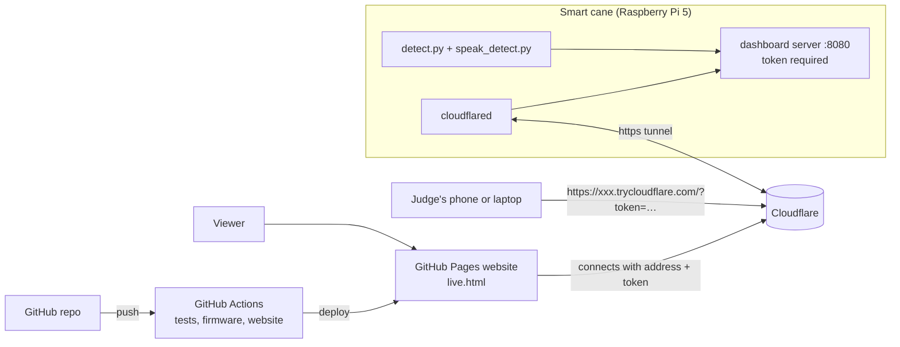

# Live dashboard, cloud access and CI/CD

How judges and viewers watch the cane detect objects live from anywhere, and how the repository tests, builds and publishes itself.



| Piece | Where it runs | What it gives |
|---|---|---|
| Dashboard server | On the cane, always on (`speak_detect.py --demo-port 8080`) | Camera with boxes, objects with bearing and distance, ToF vs camera distance, ground sensor, speech log |
| Secure tunnel | On the cane (`cloudflared`), only during a demo | A public https address for the dashboard, no router setup |
| Website | GitHub Pages, deployed by GitHub Actions | Project page plus `live.html`, which connects to the cane through the tunnel or plays a recording |

## 1. The dashboard on the cane

The service in `code/smartcane.service` starts the dashboard with the cane. It shows the camera, so it is always locked with a token. On first start the cane creates one in `~/.config/smartcane/demo_token` (readable only by the `pi` user). The token is never written to the journal.

The camera view is drawn only while someone has the dashboard open. With nobody watching, `detect.py` uses about 10 % of one CPU core, the same as with the dashboard off. While watched it uses about 30 % (measured on 8 October 2026).

```bash
curl http://localhost:8080/health                                          # ok
curl -s -o /dev/null -w '%{http_code}\n' http://localhost:8080/state.json  # 403 without the token
cat ~/.config/smartcane/demo_token                                         # the token
```

On the same Wi-Fi, open `http://smartcane.local:8080/?token=<token>`.

## 2. Make it reachable from anywhere (Cloudflare Tunnel)

A tunnel lets the cane make an outgoing connection to Cloudflare, which gives it a public https address. No port forwarding, and it works on a phone hotspot.

Install `cloudflared` on the Pi once (installed on the prototype on 8 October 2026, version 2026.10.0):

```bash
curl -L -o /tmp/cloudflared.deb \
  https://github.com/cloudflare/cloudflared/releases/latest/download/cloudflared-linux-arm64.deb
sudo dpkg -i /tmp/cloudflared.deb
cloudflared --version
```

On demo day, one command in a terminal you keep open:

```bash
bash ~/smartcane/tools/go_live.sh
```

It checks the dashboard and its token, opens a quick tunnel, waits until the new address answers (a new address takes 15 to 30 s to reach DNS) and prints two links:

```text
Live dashboard, direct:   https://<random>.trycloudflare.com/?token=<token>
Through the website:      https://adeliusa486.github.io/KSCDR-Hackathon-SmartCane2.0/live.html?cane=https://<random>.trycloudflare.com&token=<token>
```

Give judges either link. Ctrl-C closes the tunnel and the dashboard is private again. A quick tunnel gets a new address each time and needs no account.

Tested on 8 October 2026 from a laptop through the public address: `/health` answers, every other address returns 403 without the token or with a wrong one, and the website's `live.html` showed the cane live (camera, detections, ground sensor, speech log).

**Why the dashboard polls instead of streaming.** Through a quick tunnel, a long-lived stream is held back: the server-sent event stream delivered 0 bytes in 6 s, and the MJPEG stream arrived in 256 KB blocks. Single requests pass at once. So the dashboard fetches `/state.json` four times a second and `/frame.jpg` on two staggered request lanes. The streaming endpoints remain for local use, for example `/stream.mjpg` in VLC.

**A fixed address** (for example `cane.yourdomain.com`) needs a free Cloudflare account and a domain on Cloudflare:

```bash
cloudflared tunnel login
cloudflared tunnel create smartcane
cloudflared tunnel route dns smartcane cane.yourdomain.com
cat > ~/.cloudflared/config.yml <<'EOF'
tunnel: smartcane
credentials-file: /home/pi/.cloudflared/<tunnel-id>.json
ingress:
  - hostname: cane.yourdomain.com
    service: http://localhost:8080
  - service: http_status:404
EOF
cloudflared tunnel run smartcane
```

Add Cloudflare Access (Zero Trust > Access > Applications) to require an email code on top of the token if the address will stay up.

Alternatives that work the same way: `tailscale funnel 8080` (Tailscale account) or `ngrok http 8080`.

### Before you go public

- **Privacy:** the camera shows whoever is in front of the cane. Tell people nearby, and close the tunnel after the demo.
- **Bandwidth:** each viewer receives up to 6 frames a second of about 30 KB, roughly 1.5 Mbit/s. On a phone hotspot, plan for a few viewers, or share one screen.
- **Power:** dashboard plus tunnel add load. Use a supply that holds 5 V (see [power.md](power.md)).
- **No internet at the venue:** the website plays a recording (section 4).

## 3. The website on GitHub Pages (CI/CD)

The repository deploys its own website with GitHub Actions.

**One-time setup** on GitHub: repository **Settings > Pages > Build and deployment > Source: GitHub Actions**.

After that, every push to `main` that changes the website, the docs or the dashboard runs `.github/workflows/pages.yml`:

1. checks out the repository,
2. runs `python web/build.py` (project page, `live.html` from `code/demo_dashboard.html`, figures, charts, the objects list generated from the model's data, and `web/replay/`),
3. deploys `web/_site` to `https://adeliusa486.github.io/KSCDR-Hackathon-SmartCane2.0/`.

The live page `…/live.html` connects to a cane when opened with `?cane=…&token=…` or when you paste the tunnel address and token into its form. GitHub Pages is https, so it can reach the cane only through the https tunnel, never through `http://smartcane.local`: browsers block that mix.

**Continuous integration**, `.github/workflows/ci.yml`, runs on every push and pull request:

| Job | What it checks |
|---|---|
| Cane software tests | `flake8` for syntax errors and undefined names, then the 62 tests in `code/tests/test_cane.py` (on Linux the serial-link tests run too), then the training-pipeline tests |
| ESP32 firmware build | Compiles `code/esp32/cane_safety` with ESP32 core 3.3.12 and VL53L0X 1.3.1, the versions on the cane, and keeps the `.bin` as a download of the run |
| Website build | Builds the site and checks both pages exist |

The badge at the top of the README shows the latest result.

## 4. A recording for when the internet fails

With the dashboard running, point the cane at a real scene and record:

```bash
python3 ~/smartcane/tools/record_demo.py --seconds 30 --out ~/replay
```

Copy the folder to `web/replay/` in the repository and push. The website's live page plays the recording whenever no cane is connected, labelled as a recording with its date: real frames with their boxes, real ToF and ground readings, and everything the cane said. The recording in the repository was made on 8 October 2026 in a room with chairs (100 frames, 30 s).

## Troubleshooting

| You see | Cause and fix |
|---|---|
| `token required` / HTTP 403 | The link has no token or the wrong one. Read it on the Pi: `cat ~/.config/smartcane/demo_token` |
| Browser: "address not found" right after `go_live.sh` | DNS has not caught up with the new address. `go_live.sh` waits for it, but some networks take longer. Reload after 30 s |
| "Cannot reach the cane" on the website | The tunnel is closed, or the address changed (quick tunnels change on every start). Run `go_live.sh` again and use the new link |
| Video stays black, data updates | The camera is restarting or the viewer's network is slow. Frames resume within a second of the camera coming back |
| `go_live.sh`: dashboard not running | The cane service is stopped, or its ExecStart lacks `--demo-port 8080`. Compare with `code/smartcane.service` |
| `go_live.sh`: answers without a token | Should not happen: the cane creates a token on start. Restart it: `systemctl --user restart smartcane` |
