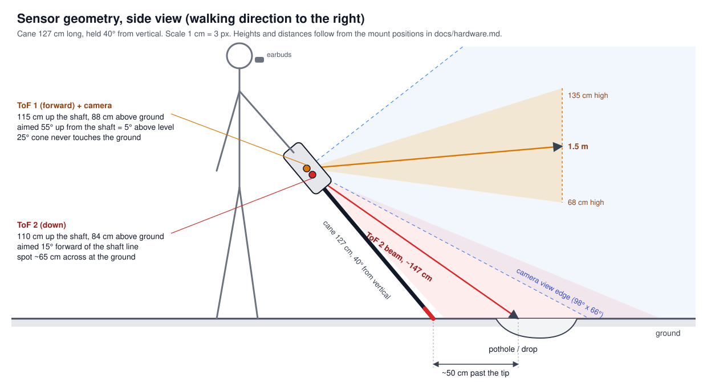
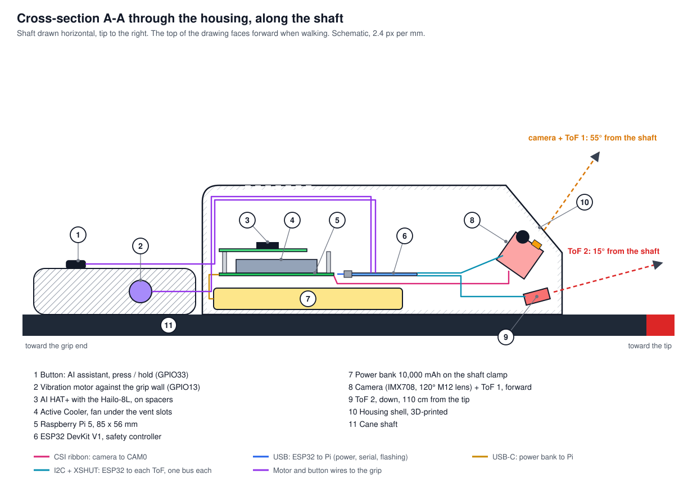

# Hardware

Everything in the prototype rides on the cane: the Raspberry Pi 5 with its AI HAT+, the ESP32 safety controller, the camera, both distance sensors, the vibration motor, the button and the power bank. Speech goes to Bluetooth earbuds.

## Bill of materials

Prices are what the prototype cost, in USD.

| # | Part | Exact model used | Job | Price |
|---|---|---|---|---|
| 1 | Main computer | Raspberry Pi 5, 2 GB | Runs vision, speech, assistant | ~$45 |
| 2 | AI accelerator | Raspberry Pi AI HAT+, Hailo-8L, 13 TOPS (confirmed with `hailortcli fw-control identify`: `HAILO8L`) | Runs the object detector, ~29 ms per frame | ~$87 |
| 3 | Cooler | Raspberry Pi 5 Active Cooler | Keeps the Pi from throttling | ~$3 |
| 4 | Storage | 32 GB A2 high-endurance microSD | Raspberry Pi OS Bookworm 64-bit Lite | ~$14 |
| 5 | Camera | Arducam B0310: Sony IMX708, 4608x2592, 120° (H) M12 lens, manual focus | Object detection, text reading, scene description | ~$53 |
| 6 | Safety controller | ESP32 DevKit V1 (ESP32-D0WD-V3, CP2102 USB bridge) | Distance sensors, vibration, buttons. Works without the Pi | ~$4 |
| 7 | Distance sensors | 2x ST VL53L0X time-of-flight breakouts | ToF 1 looks forward (obstacles), ToF 2 looks down (holes, kerbs) | owned |
| 8 | Vibration | Coin vibration motor module (signal, VCC, GND) | Obstacle and ground alerts | owned |
| 9 | Button | 1 momentary push button | AI assistant: press = describe and ask, hold = read text | owned |
| 10 | Battery | 10,000 mAh USB power bank | Powers everything through the Pi | owned |
| 11 | Audio | Soundcore Life P2 Mini Bluetooth earbuds | Speech and the assistant's microphone | owned |
| 12 | Cane | White cane, 124 to 127 cm | Body for all parts | owned |

Planned upgrades, not fitted yet: VL53L8CX 8x8-zone ToF, A02YYUW ultrasonic (glass), DRV2605L with an LRA motor, an IMU for tilt, a wired bone-conduction headset with a USB or I2S audio output, and a 5 V / 5 A power path (see [power.md](power.md)).

## Wiring

The Pi only takes power and one USB cable to the ESP32. Every sensor, the motor and the buttons hang off the ESP32, so a crash or a slow boot on the Pi never silences the obstacle and drop-off alerts.

| ESP32 pin | Goes to | Notes |
|---|---|---|
| 3V3 | ToF 1 VCC, ToF 2 VCC | One splice, the DevKit has a single 3V3 pin |
| GND | ToF 1, ToF 2, motor GND | One splice |
| GPIO21 / GPIO22 | ToF 1 SDA / SCL | I2C bus 0 (`Wire`) |
| GPIO18 / GPIO19 | ToF 2 SDA / SCL | I2C bus 1 (`Wire1`). Separate buses, so both sensors keep address 0x29 |
| GPIO26 | ToF 1 XSHUT | Hard reset of a sensor that stops answering |
| GPIO27 | ToF 2 XSHUT | Same |
| GPIO13 | Motor module IN | 200 Hz PWM |
| VIN (5 V from USB) | Motor module VCC | |
| GPIO33 | The button, to GND | Internal pull-up, pressed = LOW |
| GPIO32 | Free | The firmware reads it as a second button (same behaviour) if one is ever wired |
| Micro-USB | Raspberry Pi 5 USB port | Power for the ESP32, serial link at 115200 baud, and firmware flashing |

| Raspberry Pi 5 | Goes to |
|---|---|
| USB-C | Power bank |
| CAM0 (22-pin FPC) | Arducam B0310 camera |
| PCIe FPC + 40-pin header | AI HAT+ (Hailo-8L), stacked over the Active Cooler on spacers |
| USB-A | ESP32 DevKit V1 |
| Bluetooth | Earbuds (A2DP for speech, headset profile for the microphone) |

ESP32 pins 0, 2, 5, 12 and 15 are boot strapping pins and 34 to 39 are input-only, so none of them is used.

## Mounting geometry



*Figure 1. Side view with the cane held at a normal walking angle of 40° from vertical. Distances follow from the mount heights and angles below.*

| Item | Position on the shaft (from the tip) | Aim |
|---|---|---|
| ToF 2 (down) | 110 cm | Top face of the shaft, tilted 15° further forward than the shaft line |
| ToF 1 (forward) and camera | about 115 cm | 55° up from the shaft line, so about 5° above level when walking |

At a 40° grip ToF 2 sits 84 cm above the ground. Its beam reaches the ground about 147 cm away, roughly 50 cm past the tip, with a spot about 65 cm wide. ToF 1 sits 88 cm up. At 1.5 m its 25° cone covers 68 to 135 cm of height, so the ground never enters it.

Two rules from testing:

- ToF 2 must point at the ground ahead of the tip, not along the shaft. If its cone hits the shaft or the tip it reads a constant ~110 cm and learns that as "ground".
- Hold the cane the way you walk when you set the camera rotation. With the cane held, the picture must be upright (`--rotate 0`). Lying on the floor the picture turns 90°, which is expected.



*Figure 2. Cross-section through the housing along the shaft, showing how the boards stack and where the cables run. Schematic.*

## Assembly order

1. Pi 5 stack, with the Pi powered off: Active Cooler, then the four spacers with the long screws, then the GPIO stacking header, then the PCIe ribbon, then the AI HAT+ with the short screws.
2. Camera ribbon into CAM0, contacts facing the board on the Pi end. Remove the lens protector. Set focus on something 2 to 4 m away and lock the M12 barrel with a dab of paint.
3. ESP32 wiring with female Dupont crimps on the DevKit's male pins (no solder on the ESP32). Use stranded wire, heat-shrink every joint, and anchor each cable so a pull lands on the anchor, not on the joint. Loose joints were the cause of every sensor fault so far.
4. ToF 2 on the shaft at 110 cm, ToF 1 and the camera at about 115 cm, angles as above.
5. Motor against the inside wall of the grip, where the palm or index finger presses. A motor that floats in the housing is felt much less.
6. One USB cable ESP32 to Pi, one USB-C cable power bank to Pi.

## Bring-up checks

```bash
rpicam-hello --list-cameras            # expect: imx708 [4608x2592 10-bit]
hailortcli fw-control identify         # expect: Device Architecture: HAILO8L
python3 ~/smartcane/check_hardware.py  # camera, Hailo, PCIe Gen3 and model checks
python3 ~/smartcane/esp32_link.py --send T --send S --seconds 3
#   expect: tof1 id EE AA 10, tof2 id EE AA 10, fw=2026-10-08, D lines at 20 Hz
```
