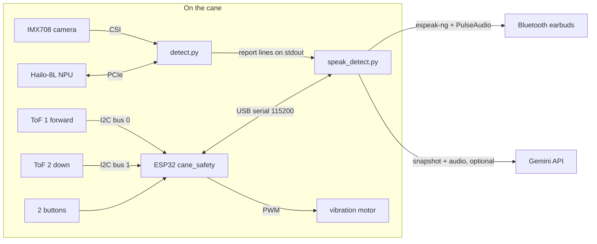

# Software

Three programs share the work. Each can be tested and replaced on its own.

| Program | Runs on | Job |
|---|---|---|
| `code/esp32/cane_safety/cane_safety.ino` | ESP32 | Reads both ToF sensors, drives the motor, watches the ground, reads the buttons. Vibrates about 1 s after power-on and keeps working if the Pi crashes |
| `code/detect.py` | Pi 5 | Camera to Hailo-8L to named objects with direction and distance. Prints one report line every 0.3 s |
| `code/speak_detect.py` | Pi 5 | Runs `detect.py`, joins its reports with the ESP32's distances, decides what to say, speaks it, syncs a buzz, runs the AI assistant |



## detect.py: what the camera sees

Each frame goes through the same five steps.

1. **Capture.** Picamera2 gives a 1280x720 main stream and a 640x360 lores stream from one sensor readout. Picamera2 picks the IMX708's 1536x864 mode, a centre crop of the sensor, so the picture covers 98.2° across, not the lens's full 120°. `detect.py` reads the crop at start-up and uses the real figure.
2. **Prepare.** The lores frame is turned upright (`--rotate`), kept in R,G,B order (the lores format is `BGR888`, which Picamera2 delivers as R,G,B bytes), and letterboxed into the model's 640x640 input with grey bars, the same way Ultralytics validates. The old path squeezed 16:9 into a square and swapped red and blue. See [results.md](results.md) for what that cost.
3. **Detect.** The Hailo-8L runs `smartcane152_v3_h8l.hef` (YOLO11s, 152 classes) in about 29 ms. Non-maximum suppression runs per class on the CPU inside HailoRT.
4. **Clean up.** Boxes are mapped back to the picture, boxes of different classes that overlap by IoU 0.7 or more are merged (one object, one name), and the list is ranked: drop-offs first, then vehicles, people and animals, then everything else, nearest first.
5. **Describe.** Each object gets a direction and a distance:
   - **Direction** is the bearing of the box centre in degrees. Within ±15° of straight ahead, or any box that crosses the centre line, is "ahead". Left and right are the camera's left and right: if someone faces the cane, their left is the cane's right.
   - **Distance** from the camera is a pinhole estimate, `real height x focal length / box height`, for 60 classes with a typical height (people, vehicles, furniture, doors). Boxes cut by the frame edge get no estimate, because a cut box makes the object look further away than it is.

Output line, every 0.3 s:

```text
[ 10.0 fps]  chair ahead, close @0.82 | backpack left, near 1.3m @0.75 | box left, near 0.6m @0.74
```

## speak_detect.py: what the user hears

| Rule | Why |
|---|---|
| Detector threshold 0.25, naming threshold 0.35. Between the two the object is "obstacle" | A wrong name erodes trust, "obstacle" never does, and nothing physical is dropped |
| A class must appear in 3 reports in a row (`--confirm 3`, about 0.9 s) | Removes one-frame ghosts |
| Each object has its own repeat timer (4 s), keyed on its distance band | A person standing still is not repeated every report, an approaching one is |
| At most 2 objects per sentence, the most urgent ones not said recently | In a room the cane moves on from the person to the table and the door |
| Never queue speech | A queue tells the user about things they already walked past |
| ToF distance "1.2 meters" for an object straight ahead, only if the camera's own estimate agrees within 2x | Otherwise the beam is on something else |
| Camera estimate "about 2.5 meters" otherwise, in half-metre steps | It is only good to about ±30 % |
| Ground alarms ("Careful, drop ahead", "Step up ahead") wait up to 2 s for speech instead of being dropped | Missing one means stepping into a hole |
| Spoken warnings when the distance sensors, one sensor, the camera, or the ground reading fail | A cane that fails silently looks healthy while protecting nobody |
| The audio sink is checked before every phrase, dead Bluetooth is reconnected | PulseAudio silently swallows audio into a null sink |

Example sentences: "chair ahead, 1.3 meters", "chair right, about 2 meters", "obstacle ahead, 0.8 meters", "Careful, drop ahead".

### The ESP32 link

`esp32_link.py` reads the ESP32's serial lines in a background thread. It reopens the port after 3 s of silence and keeps looking for the ESP32 if it is missing at boot. Both were real failures on 7 and 8 October 2026: the port opened at boot and then delivered nothing for 3.5 and 10 hours, so every distance the user heard was a camera guess.

### AI assistant

`assistant.py` uses the ESP32's buttons. Assistant button: short press describes the scene, double press reads text, hold asks a spoken question (the earbud microphone records while held). The second button reads text. It sends a snapshot (and the recorded question) to Gemini (`gemini-flash-lite-latest` first), and falls back to offline Tesseract OCR for reading when there is no internet. The API key lives only on the Pi at `~/.config/smartcane/gemini_key`.

## ESP32 firmware: the reflexes

| Behaviour | Detail |
|---|---|
| Obstacle feel | Forward ToF only. Silent beyond 1.5 m. From 1.5 m to 0.4 m: pulses of 150 ms, 80 % to 100 % strength, faster as it gets closer. Under 0.4 m: solid |
| Motor kick | Every buzz from rest starts with 40 ms at full power so the coin motor spins up |
| Ground watch | Down ToF learns the normal ground distance (median of 10 readings), follows slow drift, and alarms on a drop of more than 150 mm, "nothing in range", or a rise of more than 120 mm. One 500 ms full-strength pulse, 2.5 s hold-off. A change lasting 2 s is a new grip angle and is relearned. Things nearer than 0.7x the ground distance, or rises while ToF 1 sees something within 1.5 m, are obstacles, not steps |
| Filtering | Median of 3. Readings the sensor itself flags as hardware or phase failures (range status 1, 2, 3, 6, 9) count as nothing in range. 1,514 of 1,514 bench readings had status 11 (valid) |
| Self-healing | A sensor silent for 300 ms is reset through XSHUT and re-initialised every second |
| Both sensors | Long-range mode (signal rate limit 0.1 MCPS, VCSEL 18/14, 33 ms budget), about 2 m indoors, less in sunlight |

### Serial protocol (115200 baud, one line per message)

| Direction | Line | Meaning |
|---|---|---|
| ESP32 to Pi | `D <ms> <fwd> <down> <fok> <dok> <ground>` | 20 Hz. Distances in mm, -1 = nothing in range, ground -1 = not learned |
| | `H drop <mm> <ground>` / `H step <mm> <ground>` | Ground hazard |
| | `K down` / `K up`, `J down` / `J up` | Assistant button, read-text button |
| | `Q <tof> <mm> <status>` | Raw reading, while `Q1` is on |
| | `I ...` / `E ...` | Information / error |
| Pi to ESP32 | `B<duty>,<ms>` | One buzz, for example `B100,500` |
| | `A0` / `A1` | Automatic vibration off / on |
| | `R1` / `R2` | Which sensor is forward, saved in flash |
| | `C<tof>,<mm>` / `C<tof>,0` | Offset calibration against a flat target at a known distance / clear |
| | `F1` / `F0` | Reject / keep readings flagged as wrong, saved |
| | `Q1` / `Q0` | Raw reading stream on / off |
| | `S`, `T`, `P` | Status with range-status counts, wiring test with sensor IDs, button pin levels |

## Running

The cane starts on its own at boot through a systemd user service:

```bash
sudo loginctl enable-linger pi
cp ~/smartcane/smartcane.service ~/.config/systemd/user/
systemctl --user daemon-reload
systemctl --user enable --now smartcane
sudo journalctl _SYSTEMD_USER_UNIT=smartcane.service -f    # live log
```

Useful by hand (stop the service first, the camera and the Hailo serve one program at a time):

```bash
systemctl --user stop smartcane
cd ~/smartcane
python3 speak_detect.py --dry-run --all-classes --fps 10 \
    --model models/smartcane152_v3_h8l.hef --labels models/smartcane152.txt
python3 detect.py --model models/smartcane152_v3_h8l.hef --labels models/smartcane152.txt --all-classes
python3 tools/vision_probe.py --model models/smartcane152_v3_h8l.hef \
    --labels models/smartcane152.txt --orient      # colour order, real FOV, best --rotate
python3 esp32_link.py --send S --seconds 5          # ESP32 status and live distances
systemctl --user start smartcane
```

Flashing the ESP32 from the Pi (compile, then the verified flash script that checks the running firmware first and rolls back on any failure):

```bash
~/.local/bin/arduino-cli compile --fqbn esp32:esp32:esp32 \
    --output-dir ~/smartcane/esp32/build_NEW ~/smartcane/esp32/src_NEW/cane_safety
# edit B= (known-good build) and NEW= in a copy of tools/flash_2026-10-08.sh, then:
systemctl --user stop smartcane && nohup ~/smartcane/tools/flash_NEW.sh &
```

## Tests

`code/tests/test_cane.py` simulates the blind-user scenarios without a camera, Hailo, ESP32 or audio: names for every safety class, urgency order, flicker, the obstacle fallback, distances in metres, the ToF consistency check, per-object repeat timers, picture geometry (letterbox, rotation, FOV, distance estimate), the real `Esp32Link` on a pseudo-terminal (hazards, buttons, silence, reopen), and every assistant path and failure.

```bash
cd ~/smartcane && python3 -m unittest tests/test_cane.py      # 46 tests, all pass on the Pi
python -m pytest code/tests/test_cane.py -q                    # on a PC: 40 pass, 6 pty tests skip
```

`code/training/tests/` covers the dataset build, pseudo-label cleaning and the MTSD relabel step.

## Tools

| Tool | Use |
|---|---|
| `tools/vision_probe.py` | Live check of colour order, field of view and the best `--rotate` |
| `tools/hazard_eval.py` | Runs labelled photos through the Hailo, per safety class, with A/B options for the camera path |
| `tools/esp32_capture.py` | Records the ESP32's output with timing statistics |
| `tools/haptic_check.py` | Shows the commanded motor duty at 20 Hz |
| `tools/flash_2026-10-0*.sh` | Verified ESP32 flashes, one per firmware release |
| `tools/power_soak.sh`, `soak_summary.py` | Power and under-voltage soak tests |
| `tools/hailort_install.sh`, `hailort_rollback.sh` | HailoRT 4.23 install with rollback |
| `tools/snapshot_pi.sh`, `sd_image.ps1`, `sd_image_check.py` | Full state snapshot and SD card image |
