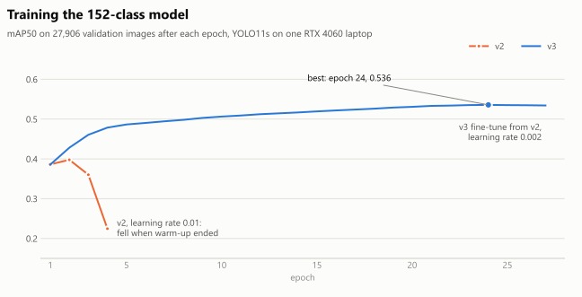
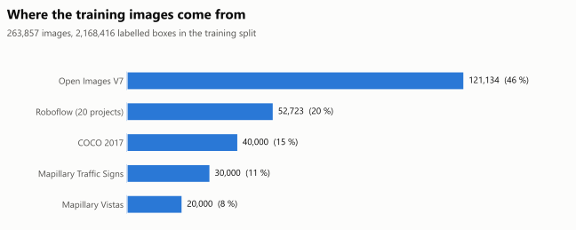

# Training data and models

The cane's detector is **smartcane152_v3**: YOLO11s trained on 152 classes chosen for a blind pedestrian on sidewalks, at crossings and indoors, then compiled for the Hailo-8L. The full class list with per-class accuracy is in [objects.md](objects.md).

## Why a custom model

Every prebuilt detector for the Hailo-8L is COCO with 80 classes. COCO has no stairs, curb, pothole, manhole, open hole, pole, bollard, crosswalk, door or traffic sign, which are the things a cane user needs most. Very large class lists (Open Images' 600) are reported to fail the Hailo compile on the 8L and dilute accuracy, so the list was curated to 152 classes, each with a written reason in `code/training/classes_v2.yaml`. Anything the model cannot name is still announced as "obstacle".

## Dataset: merged_v2

| | Images | Labelled boxes |
|---|---|---|
| Train | 235,951 | see `data/merged_v2/class_counts.csv` |
| Validation | 27,906 | |

Sources, merged into one YOLO dataset by `code/training/build_dataset.py` with the class mapping in `code/training/classes_v2.yaml`:

| Source | What it adds | Licence |
|---|---|---|
| [COCO 2017](https://cocodataset.org) | People, vehicles, animals, furniture, household objects | Annotations CC BY 4.0, images under Flickr terms |
| [Open Images V7](https://storage.googleapis.com/openimages/web/index.html), fetched with FiftyOne (`fetch_openimages.py`) | Doors, stairs, signs, street lights, buildings, wheelchairs and more | Annotations CC BY 4.0, images listed as CC BY 2.0 |
| [Mapillary Vistas v2](https://www.mapillary.com/dataset/vistas) (`convert_vistas.py`) | Curbs, curb ramps, crosswalks, poles, manholes, rail tracks, potholes from street-level photos | CC BY-NC-SA 4.0 (non-commercial) |
| [Mapillary Traffic Sign Dataset](https://www.mapillary.com/dataset/trafficsign) (`convert_mtsd.py`) | Traffic sign types, stop signs | Free for research, commercial use needs a licence from Mapillary |
| 20 [Roboflow Universe](https://universe.roboflow.com) projects (`roboflow_sources.yaml`, `roboflow_fetch.py`) | Assistive-navigation sets: pedestrian signals, crosswalk buttons, ATMs, wet floor signs, potholes, open holes and others | 19 CC BY 4.0, 1 Public Domain, recorded per project in `roboflow_sources.yaml` |

Images per source (from `data/merged_v2/source_counts.csv`, which also splits the 20 Roboflow projects):

| Source | Train | Validation | Total |
|---|---|---|---|
| Open Images V7 | 107,712 | 13,422 | 121,134 |
| Roboflow (20 projects) | 48,154 | 4,569 | 52,723 |
| COCO 2017 | 35,578 | 4,422 | 40,000 |
| Mapillary Traffic Sign Dataset | 26,733 | 3,267 | 30,000 |
| Mapillary Vistas v2 | 17,774 | 2,226 | 20,000 |
| **Total** | **235,951** | **27,906** | **263,857** |

The training split has 2,168,416 labelled boxes.

### Pseudo-labelling and cleaning

Each source labels only its own classes. A COCO photo has no "traffic sign" boxes even when signs are in it, and a model trained on that learns that signs are background. `pseudo_label.py` ran two teacher models over every image and added a box only where no existing box of that class overlapped:

- `yolo11m.pt` (COCO), 53 of its classes map onto ours
- `yolov8m-oiv7.pt` (Open Images), 119 of its classes map onto ours

That added **517,087 boxes**. Spot checks found two systematic errors, which `clean_pseudo.py` removed before training: the dashcam bonnet in Mapillary photos boxed as "car", and sign backs and logos boxed as "stop sign" (3,756 boxes in all, logged in `pseudo_removed.csv`). `relabel_mtsd_stop.py` then turned 573 MTSD stop signs that the converter had folded into "traffic sign" back into "stop sign". Human labels are never changed: a label file is always the human lines followed by the added ones, and `labels_human/` keeps the human-only version.

### What is in this repository

The images (88 GB) cannot go into git. Everything else is here, so the set can be rebuilt from the original sources:

| File | Content |
|---|---|
| `data/merged_v2/labels_train.tar.xz`, `labels_val.tar.xz` | Every final YOLO label file (human + pseudo, cleaned) |
| `data/merged_v2/labels_human_train.tar.xz`, `labels_human_val.tar.xz` | The human labels before pseudo-labelling |
| `data/merged_v2/pseudo_labels.csv.zip`, `pseudo_removed.csv`, `mtsd_stop_relabel.csv` | Every added, removed and relabelled box |
| `data/merged_v2/class_counts.csv`, `source_counts.csv` | Boxes and images per class, images per source |
| `data/merged_v2/smartcane.yaml` | Ultralytics dataset file with a relative path |

Unpack with `tar -xf labels_train.tar.xz` (works on Linux, macOS and Windows 10 or later).

Image file names carry the source and the original ID, for example `coco__train2017__000000000042.jpg` or `vistas__val__kReK1GrIyeegBJSwwdoRdA.jpg`, so each label file names the exact image to fetch. Labels derived from Mapillary Vistas and MTSD keep those datasets' non-commercial terms. See [data/LICENSE.md](../data/LICENSE.md).

## Training runs

All runs on one laptop: NVIDIA RTX 4060 Laptop GPU, Intel i9-13900H, Ultralytics 8.4.155, torch 2.5.1+cu121, Windows. The main training process turned out to be bound to one CPU core, so the GPU was often idle and epochs took about 1 to 2 hours.

| Run | Start | Settings | Result |
|---|---|---|---|
| v2 | `yolo11s.pt` (COCO) | 40 epochs planned, batch 24, SGD, lr0 0.01 | mAP50 0.386, 0.398, 0.360, then **0.225** at epoch 4 when warm-up ended at lr 0.01. Stopped |
| **v3** | v2 `best.pt` (epoch 2) | SGD, batch 24, lr0 0.002 cosine to 5 %, warm-up 0.5 epoch, close-mosaic 4, patience 8, 45 h budget, watchdog that restarts from the best checkpoint with half the learning rate if mAP falls | 27 epochs logged in `results.csv` (the 45 h budget ended it). **Best epoch 24: mAP50 0.536, mAP50-95 0.376, precision 0.65, recall 0.49** |

Re-validated on 8 October 2026 with `code/training/val_per_class.py` on all 27,906 validation images: mAP50 0.535, mAP50-95 0.376. Per-class numbers are in `docs/results/v3_per_class.csv` and [objects.md](objects.md). Training curves are in `docs/results/v3_training/` and the chart below.

<picture><source media="(prefers-color-scheme: dark)" srcset="charts/training-dark.svg"></picture>

<picture><source media="(prefers-color-scheme: dark)" srcset="charts/dataset-dark.svg"></picture>

To reproduce v3 (Windows, CUDA):

```powershell
python -m venv envs\venv
.\envs\venv\Scripts\pip install torch==2.5.1 torchvision==0.20.1 --index-url https://download.pytorch.org/whl/cu121
.\envs\venv\Scripts\pip install ultralytics==8.4.155
.\envs\venv\Scripts\python code\training\train.py --data path\to\merged_v2\smartcane.yaml `
    --model path\to\v2_best.pt --epochs 100 --batch 24 --optimizer SGD `
    --lr0 0.002 --lrf 0.05 --cos-lr --warmup-epochs 0.5 --close-mosaic 4 --patience 8 --time 45.25 `
    --name smartcane152_v3
```

The 45-hour `--time` budget, not the epoch count, ends the run. `code/training/train_v3.ps1` is the exact script that ran, with the watchdog.

## Compiling for the Hailo-8L

The Hailo Dataflow Compiler runs only on x86 Linux, so it ran in WSL2 Ubuntu on the same laptop.

| Step | Detail |
|---|---|
| Export | `best.pt` to ONNX, opset 11, 640x640 |
| Compiler | Hailo DFC 3.34.0 (Python 3.10, `tensorflow[and-cuda]==2.18.0` so the RTX 4060 is used). DFC 5.x targets the Hailo-10H only |
| End nodes | `/model.23/cv2.{0,1,2}.2/Conv` and `/model.23/cv3.{0,1,2}.2/Conv`, the same as the model zoo's yolov11s |
| NMS | `engine=cpu`: on-chip NMS fails with `UnsupportedMetaArchError` for meta_arch yolov8 on hailo8l, so HailoRT runs it on the Pi's CPU |
| Optimisation | `optimization_level=2`, 1,024 validation images for calibration |
| Output | `smartcane152_v3_h8l.hef`, 24.5 MiB, 5 contexts, NMS by class (152 x 30), score threshold 0.2 |
| On the Pi | Loads on HailoRT 4.23. `hailortcli benchmark`: 38.7 FPS. The cane runs it at 10 fps |

The compile settings are in `models/smartcane152_v3/smartcane152_v3.alls` and `nms_config.json`. One known mismatch: the calibration images were plain-resized to 640x640, while the cane now letterboxes. Recompiling with letterboxed calibration images is in the [implementation plan](implementation-plan.md).

## Models in this repository

| File | Size | Use |
|---|---|---|
| `models/smartcane152_v3/smartcane152_v3_h8l.hef` | 24.5 MiB | What runs on the cane (Hailo-8L) |
| `models/smartcane152_v3/smartcane152_v3_best.pt` | 18.4 MiB | PyTorch weights, for fine-tuning or running on a PC/GPU |
| `models/smartcane152_v3/smartcane152_v3.onnx` | 36.4 MiB | ONNX export used for the Hailo compile |
| `models/smartcane152_v3/smartcane152.txt` | | The 152 class names in model order |

The `.hef` and `.txt` here are byte-identical to the files running on the cane (MD5 checked on 8 October 2026).
